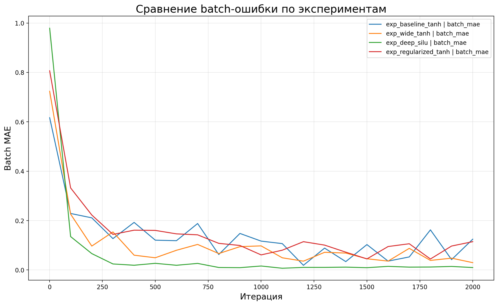
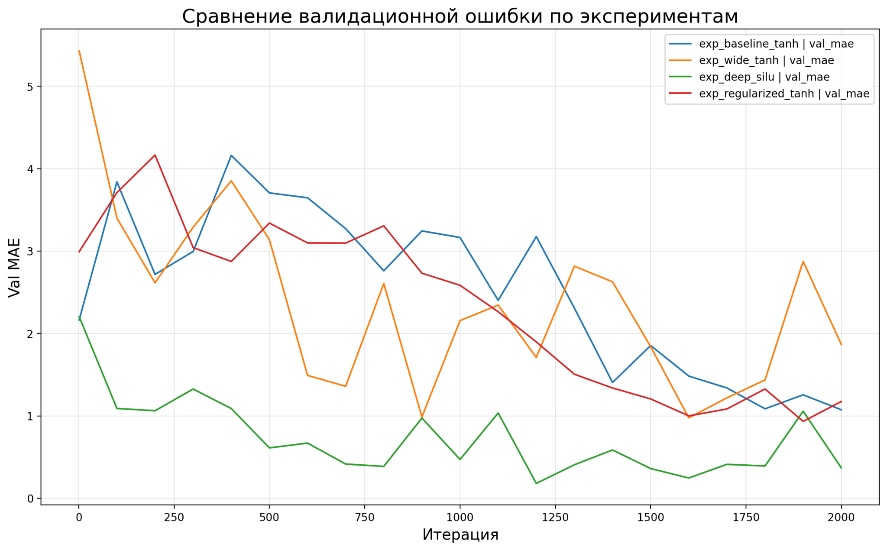
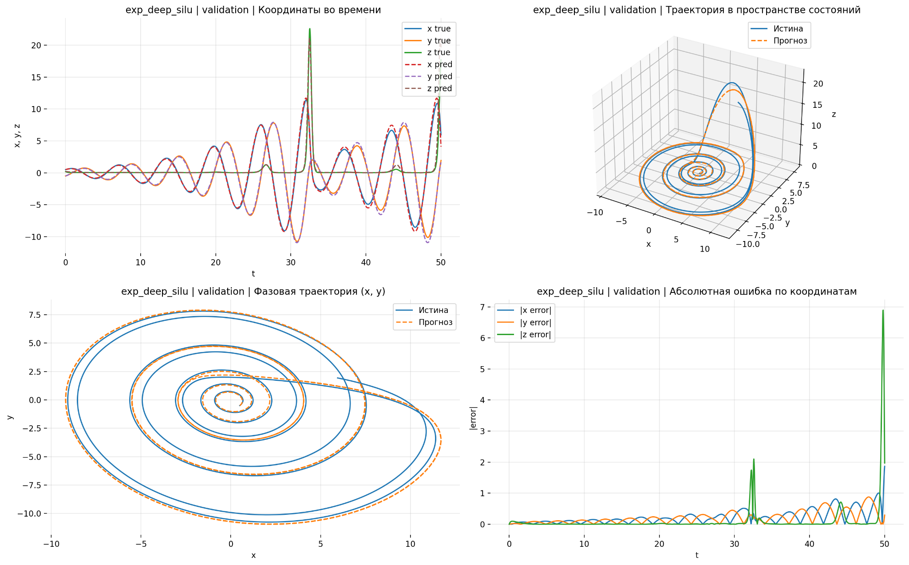
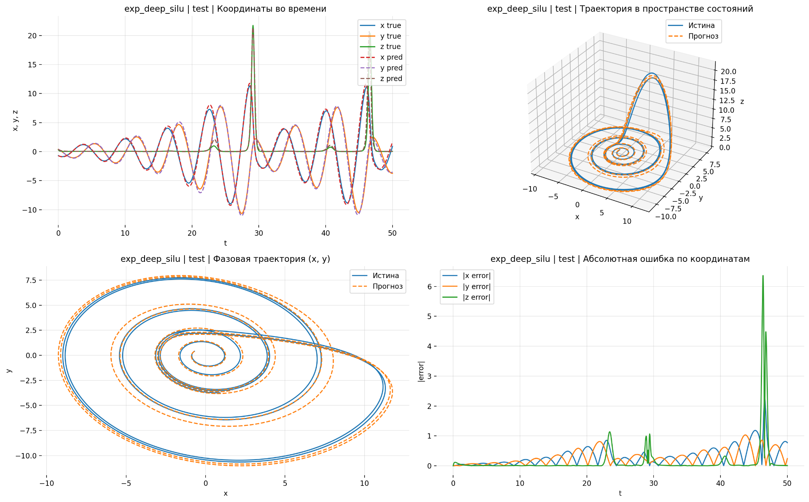
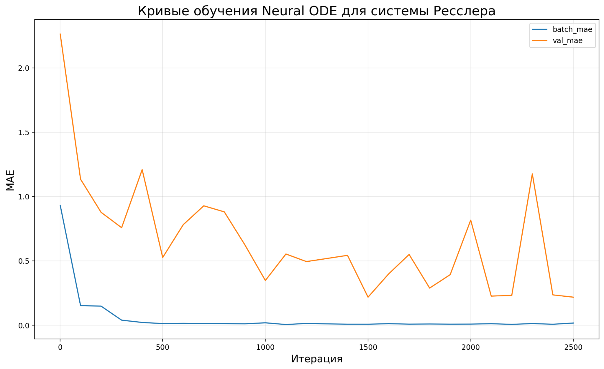
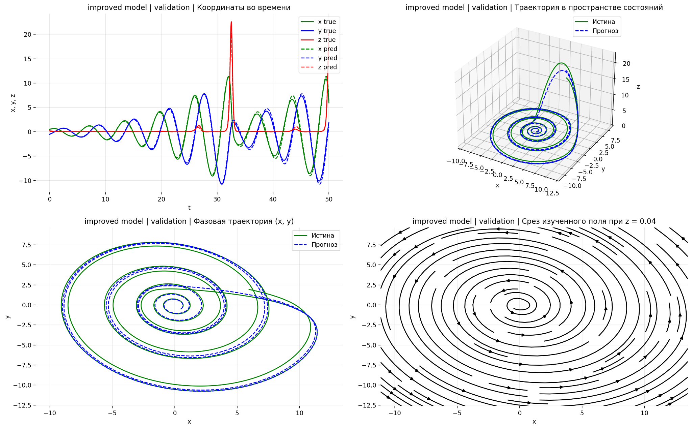
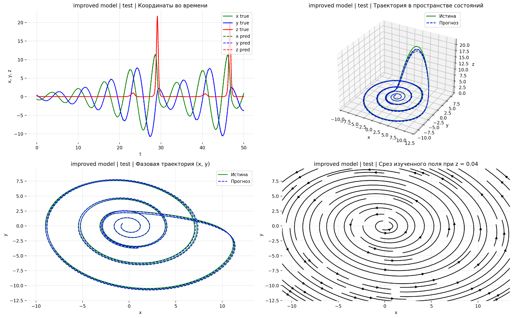

# Моделирование динамических систем с помощью нейродифференциальных уравнений

Репозиторий содержит программные материалы, разработанные в рамках выпускной квалификационной работы по теме **«Моделирование динамических систем с помощью нейродифференциальных уравнений»**.

Основная прикладная задача проекта — построение и обучение модели **Neural ODE**, аппроксимирующей динамику нелинейной трёхмерной системы Рёсслера по сгенерированным траекторным данным, а также оценка качества восстановления динамики на валидационной и тестовой траекториях.

## Краткое описание проекта

В работе рассматривается система Рёсслера с параметрами:

```text
a = 0.2
b = 0.2
c = 5.7
```

Эталонные траектории генерируются численным интегрированием исходной системы ОДУ. Затем нейронная сеть обучается аппроксимировать правую часть системы. Полученная нейросетевая правая часть интегрируется с помощью ODE-solver, после чего предсказанные траектории сравниваются с истинными.

Общий пайплайн эксперимента:

1. задание истинной системы Рёсслера;
2. генерация обучающих, валидационной и тестовой траекторий;
3. формирование батчей из временных окон;
4. обучение Neural ODE;
5. сохранение лучшей модели через callback;
6. сравнение архитектур и гиперпараметров;
7. обучение улучшенной итоговой модели;
8. расчёт метрик качества;
9. визуализация траекторий, фазовых портретов, срезов векторного поля и ошибок.

## Структура репозитория

```text
rossler-neural-ode-vkr/
├── README.md
├── requirements.txt
├── .gitignore
├── REPOSITORY_SETUP_COMMANDS.md
│
├── notebooks/
│   ├── 00_initial_neural_ode_prototype.ipynb
│   ├── 01_rossler_neural_ode_experiments_callback.ipynb
│   └── 02_rossler_neural_ode_best_model.ipynb
│
├── checkpoints/
│   ├── exp_baseline_tanh_best.pt
│   ├── exp_wide_tanh_best.pt
│   ├── exp_deep_silu_best.pt
│   ├── exp_regularized_tanh_best.pt
│   └── best_model_rossler_improved.pt
│
├── figures/
│   ├── batch_mae_comparison.png
│   ├── val_mae_comparison.png
│   ├── exp_deep_silu_validation.png
│   ├── exp_deep_silu_test.png
│   ├── rossler_improved_learning_curves.png
│   ├── improved_model_validation.png
│   ├── improved_model_test.png
│   ├── iter_0001.png
│   ├── iter_0100.png
│   ├── iter_0200.png
│   ├── iter_0300.png
│   ├── iter_0500.png
│   ├── iter_1000.png
│   ├── iter_1500.png
│   └── iter_2500.png
│
├── results/
│   ├── rossler_experiments_metrics.csv
│   ├── best_rossler_experiment_log.txt
│   ├── rossler_improved_metrics.csv
│   └── rossler_improved_log.txt
│
└── docs/
    ├── torchinfo_summary_best_rossler.txt
    └── torchinfo_summary_rossler_improved.txt
```

## Описание файлов

| Файл / папка | Назначение |
|---|---|
| `notebooks/00_initial_neural_ode_prototype.ipynb` | Исходный прототип работы с Neural ODE. |
| `notebooks/01_rossler_neural_ode_experiments_callback.ipynb` | Notebook с серией экспериментов, callback для сохранения лучшей модели, сравнением архитектур и метрик. |
| `notebooks/02_rossler_neural_ode_best_model.ipynb` | Отдельное обучение улучшенной модели Neural ODE для системы Рёсслера с визуализацией траектории и среза векторного поля. |
| `checkpoints/exp_*_best.pt` | Сохранённые веса лучших моделей из серии сравнительных экспериментов. |
| `checkpoints/best_model_rossler_improved.pt` | Сохранённые веса итоговой улучшенной модели. |
| `figures/batch_mae_comparison.png` | Сравнение batch MAE по экспериментам. |
| `figures/val_mae_comparison.png` | Сравнение validation MAE по экспериментам. |
| `figures/exp_deep_silu_validation.png` | Визуализация лучшего эксперимента `exp_deep_silu` на validation. |
| `figures/exp_deep_silu_test.png` | Визуализация лучшего эксперимента `exp_deep_silu` на test. |
| `figures/rossler_improved_learning_curves.png` | Кривые обучения итоговой улучшенной модели. |
| `figures/improved_model_validation.png` | Визуализация итоговой улучшенной модели на validation. |
| `figures/improved_model_test.png` | Визуализация итоговой улучшенной модели на test. |
| `figures/iter_*.png` | Промежуточные визуализации обучения итоговой модели по итерациям. |
| `results/rossler_experiments_metrics.csv` | Таблица метрик по серии экспериментов. |
| `results/best_rossler_experiment_log.txt` | Текстовый лог лучшего эксперимента из серии сравнений. |
| `results/rossler_improved_metrics.csv` | Таблица метрик итоговой улучшенной модели. |
| `results/rossler_improved_log.txt` | Текстовый лог обучения итоговой улучшенной модели. |
| `docs/torchinfo_summary_best_rossler.txt` | Сводка архитектуры лучшей модели из серии экспериментов. |
| `docs/torchinfo_summary_rossler_improved.txt` | Сводка архитектуры итоговой улучшенной модели. |

## Используемые методы

- Neural Ordinary Differential Equations;
- численное интегрирование ОДУ методом `dopri5`;
- аппроксимация правой части системы нейронной сетью;
- обучение на временных окнах траекторий;
- callback для сохранения лучшей модели;
- gradient clipping для стабилизации обучения;
- терминальное слагаемое в функции потерь для усиления штрафа за ошибку в конце временного окна;
- сравнение моделей по MAE, RMSE, MaxAE и R² по координатам.

## Серия сравнительных экспериментов

В основном сравнительном эксперименте были проверены следующие конфигурации:

| Эксперимент | Архитектура | Активация | LR | Weight decay | Batch time | Solver |
|---|---:|---|---:|---:|---:|---|
| `exp_baseline_tanh` | `(64, 64, 32)` | `tanh` | 0.001 | 0 | 20 | `dopri5` |
| `exp_wide_tanh` | `(128, 128, 64)` | `tanh` | 0.001 | 1e-5 | 25 | `dopri5` |
| `exp_deep_silu` | `(128, 128, 128, 64)` | `silu` | 0.0005 | 1e-5 | 30 | `dopri5` |
| `exp_regularized_tanh` | `(64, 64, 64)` | `tanh` | 0.0005 | 1e-4 | 25 | `dopri5` |

По итогам этой серии лучшей конфигурацией стала модель `exp_deep_silu`.

| Метрика | Значение |
|---|---:|
| Validation MAE | 0.1807 |
| Validation RMSE | 0.4066 |
| Test MAE | 0.2410 |
| Test RMSE | 0.4796 |
| Test R² по x | 0.9891 |
| Test R² по y | 0.9916 |
| Test R² по z | 0.9452 |

## Итоговая улучшенная модель

После серии сравнительных экспериментов была обучена отдельная улучшенная модель. В ней сохранена наиболее удачная архитектура `exp_deep_silu`, но дополнительно использованы стабилизирующие приёмы обучения.

Основная конфигурация итоговой модели:

```text
Hidden layers: 128 → 128 → 128 → 64
Activation: SiLU
Learning rate: 0.0005
Weight decay: 1e-5
Batch size: 64
Batch time: 30
Gradient clipping: 1.0
Terminal weight: 0.3
Solver: dopri5
Trainable parameters: 41 987
```

Результаты итоговой модели:

| Метрика | Validation | Test |
|---|---:|---:|
| MAE | 0.2179 | 0.0844 |
| RMSE | 0.3619 | 0.1951 |
| MaxAE | 3.1116 | 2.0903 |
| R² по x | 0.9912 | 0.9988 |
| R² по y | 0.9892 | 0.9989 |
| R² по z | 0.9836 | 0.9889 |

## Визуализация результатов

### Сравнение batch MAE по экспериментам



### Сравнение validation MAE по экспериментам



### Лучшая модель из серии экспериментов на валидационной траектории



### Лучшая модель из серии экспериментов на тестовой траектории



### Кривые обучения итоговой улучшенной модели



### Итоговая улучшенная модель на валидационной траектории



### Итоговая улучшенная модель на тестовой траектории



## Установка и запуск

Клонировать репозиторий:

```bash
git clone https://github.com/<username>/rossler-neural-ode-vkr.git
cd rossler-neural-ode-vkr
```

Создать виртуальное окружение:

```bash
python -m venv .venv
```

Активировать окружение:

```bash
# Windows PowerShell
.venv\Scripts\Activate.ps1

# Linux / macOS
source .venv/bin/activate
```

Установить зависимости:

```bash
pip install -r requirements.txt
```

Запустить Jupyter Notebook:

```bash
jupyter notebook
```

Рекомендуемый порядок просмотра:

1. `notebooks/00_initial_neural_ode_prototype.ipynb` — исходный прототип;
2. `notebooks/01_rossler_neural_ode_experiments_callback.ipynb` — серия экспериментов и выбор лучшей конфигурации;
3. `notebooks/02_rossler_neural_ode_best_model.ipynb` — обучение итоговой улучшенной модели и построение финальных визуализаций.

## Ключевой реализованный функционал

- генерация эталонных траекторий системы Рёсслера;
- обучение Neural ODE на нескольких траекториях;
- выборка батчей из временных окон;
- сравнение нескольких архитектур и функций активации;
- сохранение лучшей модели по валидационной ошибке;
- обучение итоговой улучшенной модели;
- расчёт метрик MAE, MSE, RMSE, MaxAE, R²;
- построение графиков обучения, фазовых траекторий и срезов векторного поля;
- сохранение результатов в CSV, TXT, PNG и PT.

## Вывод

Полученные результаты показывают, что модель Neural ODE с глубокой архитектурой и функцией активации `SiLU` способна аппроксимировать динамику нелинейной трёхмерной системы Рёсслера. Серия экспериментов позволила выбрать наиболее перспективную конфигурацию, а дальнейшее обучение улучшенной модели с использованием gradient clipping и терминального штрафа позволило повысить точность восстановления траектории на тестовой выборке.
